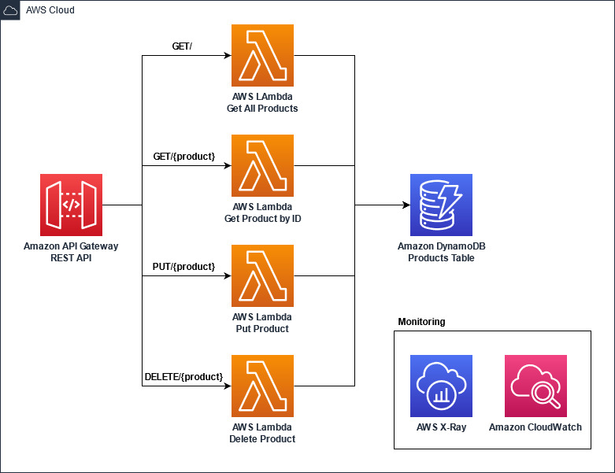

## Lambda demo with common Java application frameworks

  

This is a simple serverless application built in Java using popular frameworks - [Micronaut](https://micronaut.io/), [Quarkus](https://quarkus.io/), and [Spring Boot](https://spring.io/projects/spring-boot)

It consists of an [Amazon API Gateway](https://aws.amazon.com/api-gateway/) backed by four [AWS Lambda](https://aws.amazon.com/lambda/)
functions and an [Amazon DynamoDB](https://aws.amazon.com/dynamodb/) table for storage.

## Requirements

- [AWS CLI](https://aws.amazon.com/cli/)
- [AWS SAM](https://aws.amazon.com/serverless/sam/)
- Java 11
- Maven
- [Artillery](https://www.artillery.io/) for load-testing the application
- Docker (at least 8GB memory and 4 CPUs)

## Software

Each of the sub folders contains a Products Maven project. Each Maven project contains all the code for all four
Lambda functions. It uses the hexagonal architecture pattern to decouple the entry points, from the main domain logic
and the storage logic.

## Infrastructure

The sample application can be deployed in three different ways:
1. Managed Java Runtime (without SnapStart) - This mode uses zip packaging style and runs on the JVM inside the Lambda environment.
2. Managed Java Runtime (with SnapStart) - This mode enables SnapStart on the Lambda functions. Current examples only include Spring Boot and Quarkus versions of the application.
Stay tuned for other framework examples with SnapStart. Learn more about SnapStart [here](https://docs.aws.amazon.com/lambda/latest/dg/snapstart.html).
3. Custom Runtime - This mode uses GraalVM native image and uses Custom Runtime to run on Lambda. 
   GraalVM native image is a stand-alone execution binary and does not require a JVM to run.

## Deployment and Testing

[Micronaut](micronaut)

[Quarkus](quarkus)

[Spring Boot](springboot)

[Dagger](dagger)

## Summary
Below is the cold start and warm start latencies observed. Please refer to "Load Test" section of each sub-project for more details.
All latencies listed below are in milliseconds.

[Artillery](https://www.artillery.io/) is used to make **100 requests / second for 10 minutes to our API endpoints**.

### Results from Managed Java Runtime without SnapStart

<table class="table-bordered">
        <tr>
            <th colspan="1" style="horizontal-align : middle;text-align:center;"></th>
            <th colspan="4" style="horizontal-align : middle;text-align:center;">Cold Start (ms)</th>
            <th colspan="4" style="horizontal-align : middle;text-align:center;">Warm Start (ms)</th>           
        </tr>
        <tr>
            <th></th>
            <th scope="col">p50</th>
            <th scope="col">p90</th>
            <th scope="col">p99</th>
            <th scope="col">max</th>
            <th scope="col">p50</th>
            <th scope="col">p90</th>
            <th scope="col">p99</th>
            <th scope="col">max</th>
        </tr>        
        <tr>
            <th>Micronaut</th>
            <td>4898.83</td>
            <td>5479.10</td>
            <td>7551.76</td>
            <td>10147.71</td>
            <td>9.37</td>
            <td>17.13</td>
            <td>42.35</td>
            <td>531.75</td>
        </tr>
        <tr>
            <th>Quarkus</th>
            <td><b style="color: green">2858.41</b></td>
            <td><b style="color: green">2980.96</b></td>
            <td><b style="color: green">3310.81</b></td>
            <td><b style="color: green">4639.79</b></td>
            <td><b style="color: green">7.38</b></td>
            <td><b style="color: green">12.11</b></td>
            <td><b style="color: green">25.00</b></td>
            <td><b style="color: green">231.03</b></td>
        </tr>
        <tr>
            <th>Spring Boot</th>
            <td>5517.57</td>
            <td>6442.13</td>
            <td>8616.80</td>
            <td>11551.01</td>
            <td>9.37</td>
            <td>16.86</td>
            <td>40.38</td>
            <td>319.69</td>
        </tr>
        <tr>
            <th>Dagger *</th>
            <td>3213.00</td>
            <td>3629.68</td>
            <td>4850.11</td>
            <td>6896.54</td>
            <td>8.94</td>
            <td>16.34</td>
            <td>40.38</td>
            <td>292.20</td>
        </tr>
</table>
*: Dagger is not fully comparable to other frameworks as it only provides dependency injection, and thus is much lighter than the others, which explains these results.
When choosing a framework, be conscious of the features available. Dagger was initially done with Android in mind, to provide a lightweight dependency injection framework, without introspection (like Spring). 
It fits particularly well with Lambda to reduce the initialization time, but does not provide the breadth of the others.

### Results from Managed Java Runtime with SnapStart enabled Lambda functions

<table class="table-bordered">
        <tr>
            <th colspan="1" style="horizontal-align : middle;text-align:center;"></th>
            <th colspan="4" style="horizontal-align : middle;text-align:center;">Cold Start (ms)</th>
            <th colspan="4" style="horizontal-align : middle;text-align:center;">Warm Start (ms)</th>           
        </tr>
        <tr>
            <th></th>
            <th scope="col">p50</th>
            <th scope="col">p90</th>
            <th scope="col">p99</th>
            <th scope="col">max</th>
            <th scope="col">p50</th>
            <th scope="col">p90</th>
            <th scope="col">p99</th>
            <th scope="col">max</th>
        </tr>
        <tr>
            <th>Micronaut</th>
            <td>670.31</td>
            <td>740.03</td>
            <td>862.31</td>
            <td>980.73</td>
            <td>8.52</td>
            <td>13.50</td>
            <td>29.40</td>
            <td>235.33</td>
        </tr>
        <tr>
            <th>Quarkus</th>
            <td><b style="color: green">367.98</b></td>
            <td><b style="color: green">413.63</b></td>
            <td><b style="color: green">517.43</b></td>
            <td><b style="color: green">573.76</b></td>
            <td><b style="color: green">6.66</b></td>
            <td><b style="color: green">11.27</b></td>
            <td><b style="color: green">21.66</b></td>
            <td>228.24</td>
        </tr>
        <tr>
            <th>Spring Boot</th>
            <td>767.15</td>
            <td>868.37</td>
            <td>978.05</td>
            <td>1271.93</td>
            <td>8.07</td>
            <td>13.65</td>
            <td>28.41</td>
            <td><b style="color: green">226.37</b></td>
        </tr>
</table>

### Results from GraalVM Native images running in custom runtime

<table class="table-bordered">
        <tr>
            <th colspan="1" style="horizontal-align : middle;text-align:center;"></th>
            <th colspan="4" style="horizontal-align : middle;text-align:center;">Cold Start (ms)</th>
            <th colspan="4" style="horizontal-align : middle;text-align:center;">Warm Start (ms)</th>           
        </tr>
        <tr>
            <th></th>
            <th scope="col">p50</th>
            <th scope="col">p90</th>
            <th scope="col">p99</th>
            <th scope="col">max</th>
            <th scope="col">p50</th>
            <th scope="col">p90</th>
            <th scope="col">p99</th>
            <th scope="col">max</th>
        </tr>        
        <tr>
            <th>Micronaut</th>
            <td>604.16</td>
            <td>659.02</td>
            <td>700.45</td>
            <td>893.70</td>
            <td><b style="color: green">6.30</b></td>
            <td><b style="color: green">8.00</b></td>
            <td><b style="color: green">15.88</b></td>
            <td><b style="color: green">69.9</b></td>
        </tr>
        <tr>
            <th>Quarkus</th>
            <td><b style="color: green">437.45</b></td>
            <td><b style="color: green">475.76</b></td>
            <td><b style="color: green">519.50</b></td>
            <td><b style="color: green">528.03</b></td>
            <td>7.45</td>
            <td>12.60</td>
            <td>21.32</td>
            <td>93.45</td>
        </tr>
        <tr>
            <th>Spring Boot</th>
            <td>620.66</td>
            <td>684.53</td>
            <td>721.77</td>
            <td>751.98</td>
            <td>9.10</td>
            <td>14.22</td>
            <td>23.61</td>
            <td>259.16</td>
        </tr>
</table>

## 👀 With other languages

You can find implementations of this project in other languages here:

* [☕ Java (GraalVM)](https://github.com/aws-samples/serverless-graalvm-demo)
* [🦀 Rust](https://github.com/aws-samples/serverless-rust-demo)
* [🏗️ TypeScript](https://github.com/aws-samples/serverless-typescript-demo)
* [🐿️ Go](https://github.com/aws-samples/serverless-go-demo)
* [⭐ Groovy](https://github.com/aws-samples/serverless-groovy-demo)
* [🤖 Kotlin](https://github.com/aws-samples/serverless-kotlin-demo)
* [🥅 .NET](https://github.com/aws-samples/serverless-dotnet-demo)

## Security

See [CONTRIBUTING](CONTRIBUTING.md#security-issue-notifications) for more information.

## License

This library is licensed under the MIT-0 License. See the LICENSE file.
