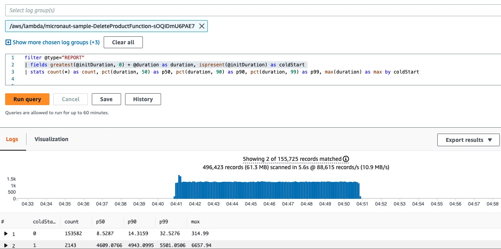
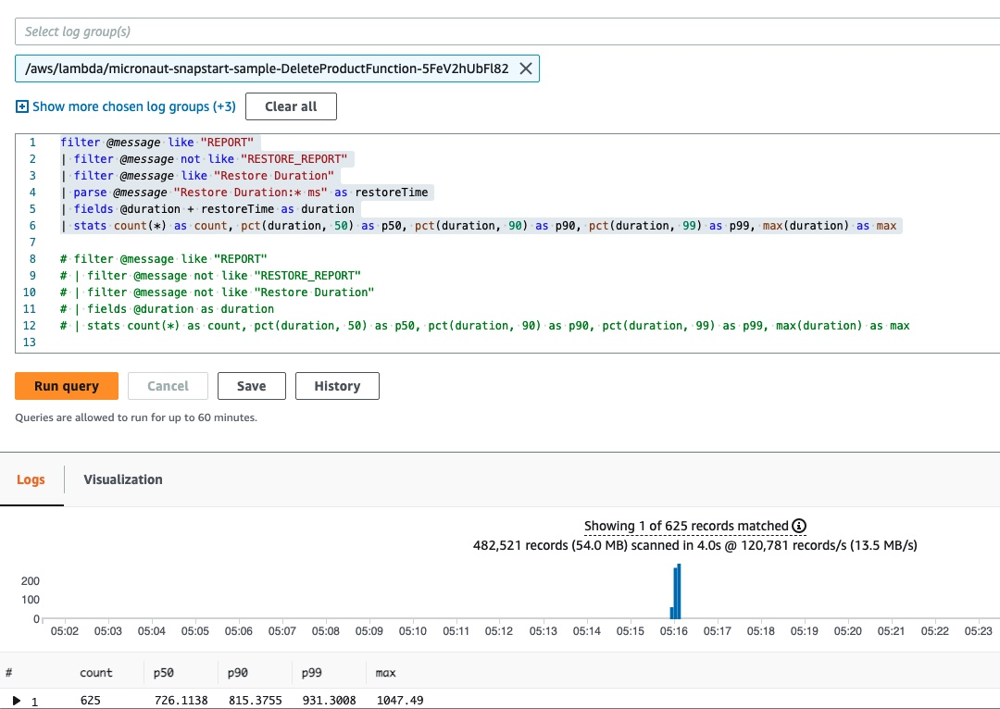
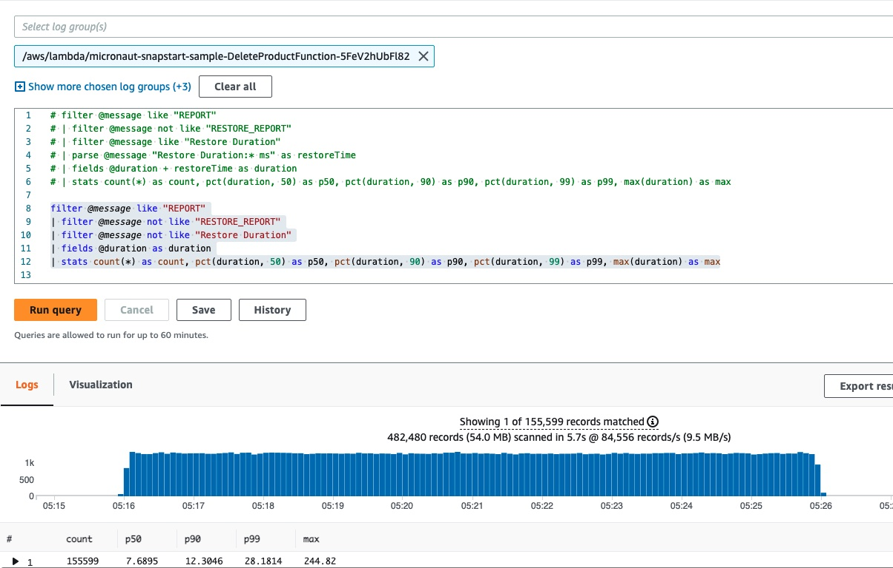
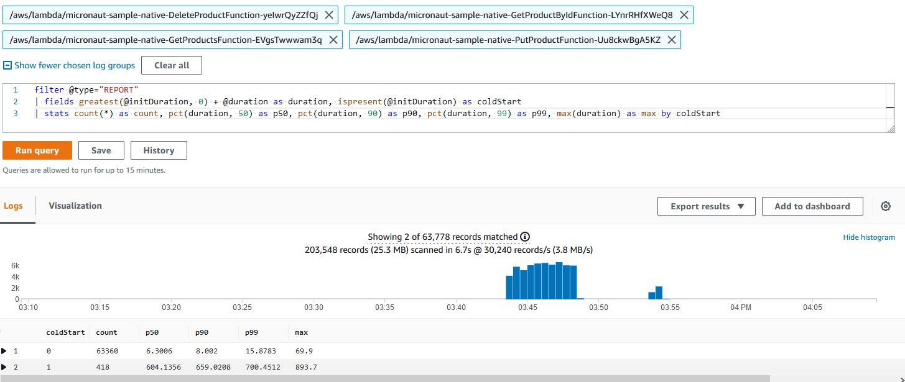
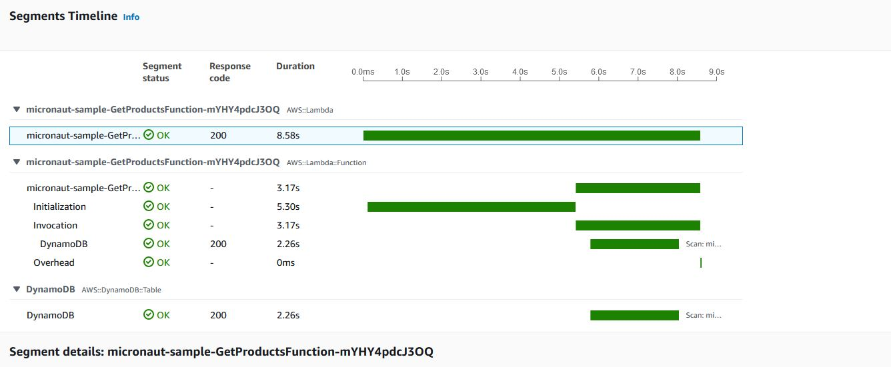
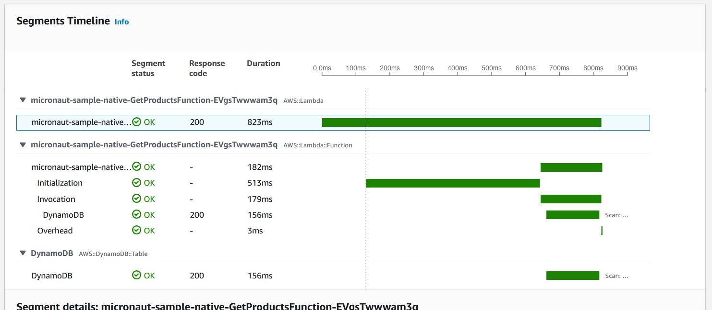
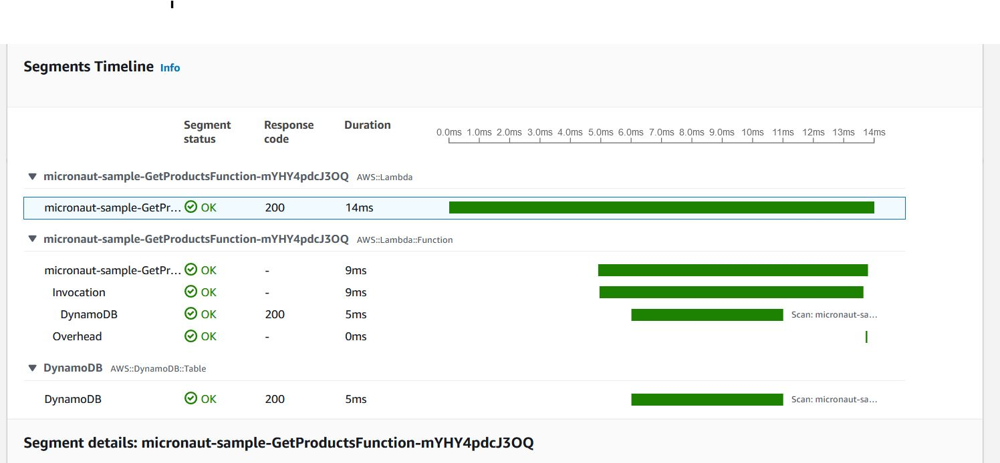
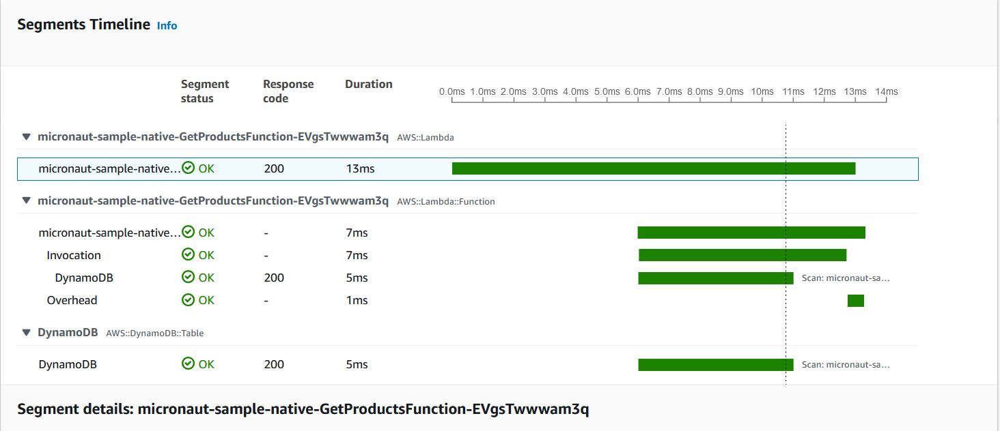

# Serverless Micronaut Application Demo

## Deployment

Deploy the demo to your AWS account using [AWS SAM](https://aws.amazon.com/serverless/sam/).

### Option 1: Managed Java Runtime (without SnapStart)

```bash
mvn clean package
sam deploy -g
```
SAM will create an output of the API Gateway endpoint URL for future use in our load tests. 
Make sure the app name used here matches with the `STACK_NAME` present under `load-test/run-load-test.sh`

### Option 2: Managed Java Runtime (with SnapStart)

```bash
mvn clean package
sam deploy -t template.snapstart.yaml -g
```
SAM will create an output of the API Gateway endpoint URL for future use in our load tests.
Make sure the app name used here matches with the `STACK_NAME` present under `load-test/run-load-test-snapstart.sh`

The SnapStart version uses techniques called Priming and Class Preloading to optimize Lambda initialization time.
You can learn more about SnapStart and Priming [here](https://aws.amazon.com/blogs/compute/reducing-java-cold-starts-on-aws-lambda-functions-with-snapstart/).

#### Eager Initialization of Singletons
You specify to eagerly initialize `@Singleton` scoped beans which is desirable for AWS Lambda. You can learn more from Micronaut's [Eager Initialization of Singletons](https://docs.micronaut.io/latest/guide/#eagerInit) documentation.

### Option 2: GraalVM Native Image

```bash
mvn clean package -Dpackaging=docker-native -Dmicronaut.runtime=lambda -Pgraalvm
```

Once above command completes, run:
```bash
sam deploy -t template.native.yaml -g
```
SAM will create an output of the API Gateway endpoint URL for future use in our load tests. 
Make sure the app name used here matches with the `STACK_NAME` present under `load-test/run-load-test-native.sh`

## Load Test

[Artillery](https://www.artillery.io/) is used to make 100 requests / second for 10 minutes to our API endpoints. 

You can run this with the following command under `load-test` directory:

```bash
cd load-test
```

### Managed Runtime
> Before running load tests, make sure you update the stack name in [load test bash script](load-test/run-load-test.sh)

```bash
./run-load-test.sh
```

### Managed Java Runtime (with SnapStart)
> Before running load tests, make sure you update the stack name in [load test bash script](load-test/run-load-test-snapstart.sh)

```bash
./run-load-test-snapstart.sh
```

### Native Image
> Before running load tests, make sure you update the stack name in [load test bash script](load-test/run-load-test-native.sh)

```bash
./run-load-test-native.sh
```

This is a demanding load test, to change the rate alter the `arrivalRate` value in `load-test.yml`.

## CloudWatch Logs Insights

Using this CloudWatch Logs Insights query you can analyse the latency of the requests made to the Lambda functions.

The query separates cold starts from other requests and then gives you p50, p90 and p99 percentiles.

**Latency for JVM version (without SnapStart):**
>:warning: Please note that this query is not applicable to SnapStart version.

```
filter @type="REPORT"
| fields greatest(@initDuration, 0) + @duration as duration, ispresent(@initDuration) as coldStart
| stats count(*) as count, pct(duration, 50) as p50, pct(duration, 90) as p90, pct(duration, 99) as p99, max(duration) as max by coldStart
```



**Latency for SnapStart version:**

AWS Lambda service logs Restoration time differently compared to cold start times in CloudWatch Logs. For this
reason, we need different CloudWatch Logs Insights queries to capture performance metrics for SnapStart functions.
Also, it's easier to get cold and warm start performance metrics with two different queries rather than one.

Use the below query to get **cold start** metrics for with SnapStart Lambda functions:

```
filter @message like "REPORT"
| filter @message not like "RESTORE_REPORT"
| filter @message like "Restore Duration"
| parse @message "Restore Duration:* ms" as restoreTime
| fields @duration + restoreTime as duration
| stats count(*) as count, pct(duration, 50) as p50, pct(duration, 90) as p90, pct(duration, 99) as p99, max(duration) as max
```



Use the below query to get warm start metrics for with SnapStart Lambda functions:
```
filter @message like "REPORT"
| filter @message not like "RESTORE_REPORT"
| filter @message not like "Restore Duration"
| fields @duration as duration
| stats count(*) as count, pct(duration, 50) as p50, pct(duration, 90) as p90, pct(duration, 99) as p99, max(duration) as max
```



**Latency for GraalVM version:**



## AWS X-Ray Tracing
You can add additional detail to your X-Ray tracing by adding a TracingInterceptor to your AWS SDK clients.

Example cold start trace for JVM version:



Example cold start trace for GraalVM version:



Example warm start trace for JVM version:



Example warm start trace for GraalVM version:



