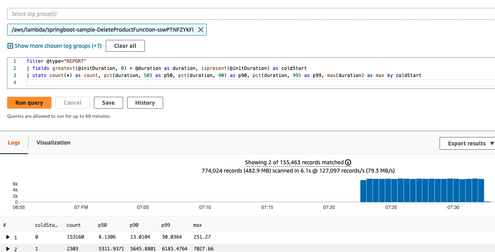
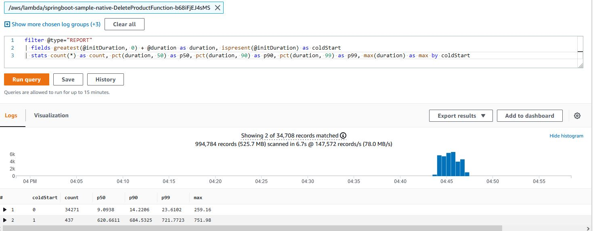
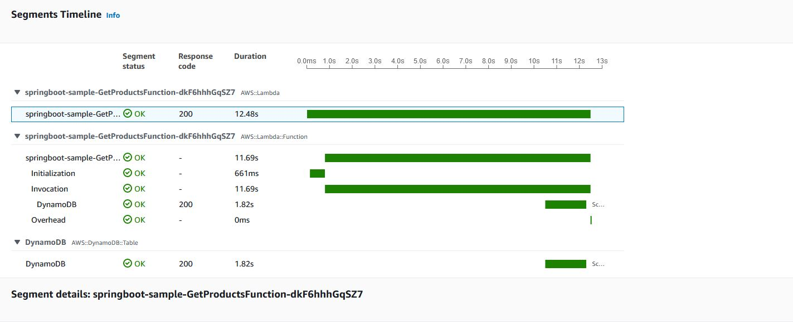
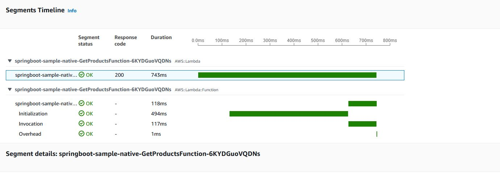
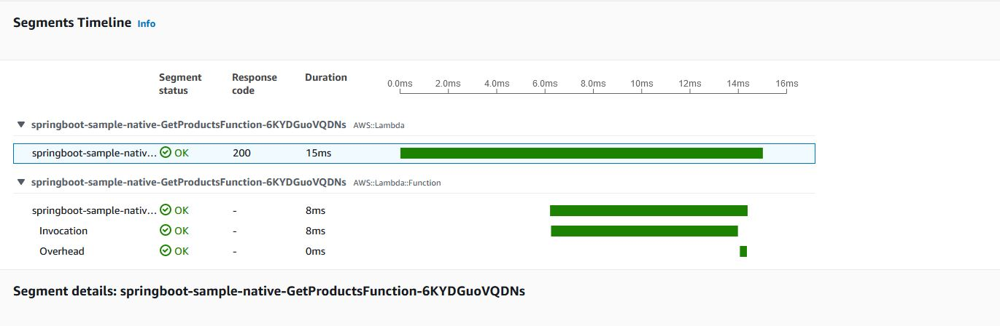

# Serverless Spring Boot Application Demo

## Deployment

Deploy the demo to your AWS account using [AWS SAM](https://aws.amazon.com/serverless/sam/).

### Option 1: Managed Java Runtime (without SnapStart)

```bash
mvn clean package
sam deploy -g
```
SAM will create an output of the API Gateway endpoint URL for future use in our load tests. 
Make sure the app name used here matches with the `STACK_NAME` present under `load-test/run-load-test.sh`

### Option 2: Managed Java Runtime (with SnapStart)

```bash
mvn clean package
sam deploy -t template.snapstart.yaml -g
```
SAM will create an output of the API Gateway endpoint URL for future use in our load tests.
Make sure the app name used here matches with the `STACK_NAME` present under `load-test/run-load-test-sanpstart.sh`

The SnapStart version uses a technique called Priming to optimize Lambda initialization time.
You can learn more about SnapStart and Priming [here](https://aws.amazon.com/blogs/compute/reducing-java-cold-starts-on-aws-lambda-functions-with-snapstart/).

### Option 3: GraalVM Native Image with Custom Runtime

On MacOS:
```bash
docker run -v ~/.m2/repository:/root/.m2/repository --mount type=bind,source=$(pwd),destination=/project -it --entrypoint /bin/bash marksailes/al2-graalvm:11-22.0.0.2
```

On MacOS ARM:
```bash
docker run --mount type=bind,source=$(pwd),destination=/project -it --entrypoint /bin/bash marksailes/arm64-al2-graalvm:17-22.0.0.2
```

On Windows:
```bash
docker run -v <SPRING_BOOT_DIR_ABSOLUTE_PATH>:/project -it --entrypoint /bin/bash marksailes/al2-graalvm:11-22.0.0.2
```
Make sure to replace `SPRING_BOOT_DIR_ABSOLUTE_PATH` with absolute path to springboot directory.

Once docker downloads the image and runs, you would see a bash command that will run inside docker container.
Run below command:

```bash
mvn clean package -Pnative
exit
```

Once above command completes, run:
```bash
sam deploy -t template.native.yaml -g
```

If you are using MacOS ARM, run:
```bash
sam deploy -t template.native.arm64.yaml -g
```

SAM will create an output of the API Gateway endpoint URL for future use in our load tests. 
Make sure the app name used here matches with the `STACK_NAME` present under `load-test/run-load-test-native.sh`

## Load Test

[Artillery](https://www.artillery.io/) is used to make 100 requests / second for 10 minutes to our API endpoints. You
can run this with the following command under `load-test` directory:

```bash
cd load-test
```

### Managed Runtime
> Before running load tests, make sure you update the stack name in [load test bash script](./load-test/run-load-test.sh)

```bash
./run-load-test.sh
```

### Native Image
> Before running load tests, make sure you update the stack name in [load test bash script](./load-test/run-load-test-native.sh)

```bash
./run-load-test-native.sh
```
### SnapStart
> Before running load tests, make sure you update the stack name in [load test bash script](./load-test/run-load-test-sanpstart.sh)

```bash
./run-load-test-snapstart.sh
```
This is a demanding load test, to change the rate alter the `arrivalRate` value in `load-test.yml`.

## CloudWatch Logs Insights

Using this CloudWatch Logs Insights query you can analyse the latency of the requests made to the Lambda functions.

The query separates cold starts from other requests and then gives you p50, p90 and p99 percentiles. 

>:warning: Please note that this query is not applicable to SnapStart version. 

```
filter @type="REPORT"
| fields greatest(@initDuration, 0) + @duration as duration, ispresent(@initDuration) as coldStart
| stats count(*) as count, pct(duration, 50) as p50, pct(duration, 90) as p90, pct(duration, 99) as p99, max(duration) as max by coldStart
```

Latency for JVM version:
<p align="center">
  
</p>

Latency for GraalVM version:

<p align="center">
  
</p>

Latency for SnapStart version:
AWS Lambda service logs Restoration time differently compared to cold start times in CloudWatch Logs. For this
reason, we need different CloudWatch Logs Insights queries to capture performance metrics for SnapStart functions.
Also, it's easier to get cold and warm start performance metrics with two different queries rather than one.

Use the below query to get Cold start metrics for with SnapStart Lambda functions:

```
filter @message like "REPORT"
| filter @message not like "RESTORE_REPORT"
| filter @message like "Restore Duration"
| parse @message "Restore Duration:* ms" as restoreTime
| fields @duration + restoreTime as duration
| stats count(*) as count, pct(duration, 50) as p50, pct(duration, 90) as p90, pct(duration, 99) as p99, max(duration) as max
```

<p align="center">
  
</p>

Use the below query to get Warm start metrics for with SnapStart Lambda functions:
```
filter @message like "REPORT"
| filter @message not like "RESTORE_REPORT"
| filter @message not like "Restore Duration"
| fields @duration as duration
| stats count(*) as count, pct(duration, 50) as p50, pct(duration, 90) as p90, pct(duration, 99) as p99, max(duration) as max
```

<p align="center">
  
</p>

## AWS X-Ray Tracing
You can add additional detail to your X-Ray tracing by adding a TracingInterceptor to your AWS SDK clients.

Please note that AWS Lambda SnapStart currently does not support X-ray tracing. For this reason, tracing is disabled for all lambda functions in SnapStart version.
Lambda SnapStart is available in the US East (Ohio, N. Virginia), US West (Oregon), Asia Pacific (Singapore, Sydney, Tokyo), and Europe (Frankfurt, Ireland, Stockholm) Regions.

Example cold start trace for JVM version:

<p align="center">
  
</p>

Example cold start trace for GraalVM version:

<p align="center">
  
</p>

Example warm start trace for JVM version:

<p align="center">
  
</p>

Example warm start trace for GraalVM version:

<p align="center">
  
</p>
